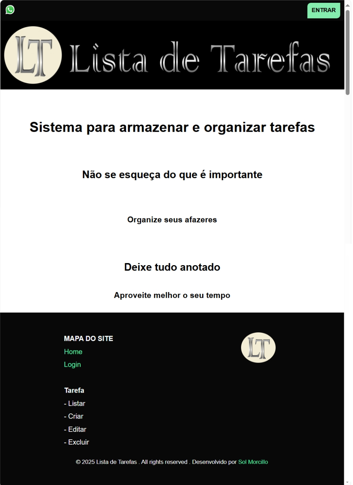

## ASP .NET Core MVC + Razor

### Avanade - Back-end com .NET e IA

Projeto de gerenciamento de tarefas

- ASP.NET Core MVC

- Razor Views

- Entity Framework Core como ORM (Object-Relational Mapper)

  => Operações CRUD:

     - Criar: _context.Tarefas.Add(tarefa)

     - Editar: _context.Tarefas.Update(tarefa)

     - Excluir: _context.Tarefas.Remove(tarefa)

     - Listar: _context.Tarefas.ToList()

- SQLite como banco de dados

O sistema permite criar, editar, excluir e listar tarefas com campos como título, descrição, status, data de criação e data de finalização.

## Funcionalidades

✅ Criar nova tarefa com data automática

✅ Editar tarefa existente com seleção via dropdown

✅ Excluir tarefa com confirmação e visualização dos dados

✅ Listar todas as tarefas em tabela organizada

✅ Validação de campos obrigatórios

✅ Interface responsiva com layout Razor

✅ Mensagens de sucesso após ações

## Tecnologias Utilizadas

ASP.NET Core MVC - Estrutura do projeto

Razor Views - Interface do usuário

Entity Framework Core - ORM para acesso ao banco de dados

SQLite - Banco de dados leve e local

jQuery - Manipulação de DOM e validações

## Como Executar o Projeto

1- Clone o repositório. No bash:

git clone https://github.com/seuusuario/listaTarefas.git

2- Restaure os pacotes. No bash:

dotnet restore

3- Crie o banco de dados. No bash:

dotnet ef migrations add InitialCreate

dotnet ef database update

4- Execute o projeto. No bash:

dotnet run ou dotnet watch run

5- Acesse no navegador:

http://localhost:5294

## Observações Importantes

- A data de criação da tarefa é gerada automaticamente e não pode ser editada.

- A edição e exclusão usam dropdown para seleção da tarefa.

- O campo Id é essencial para evitar duplicações ao editar.

- Mensagens de sucesso são exibidas com TempData.

## Melhorias Futuras

- Autenticação com perfis de usuário

- Painel com estatísticas de tarefas

- Filtros por status ou data

- Versão mobile com layout adaptado

